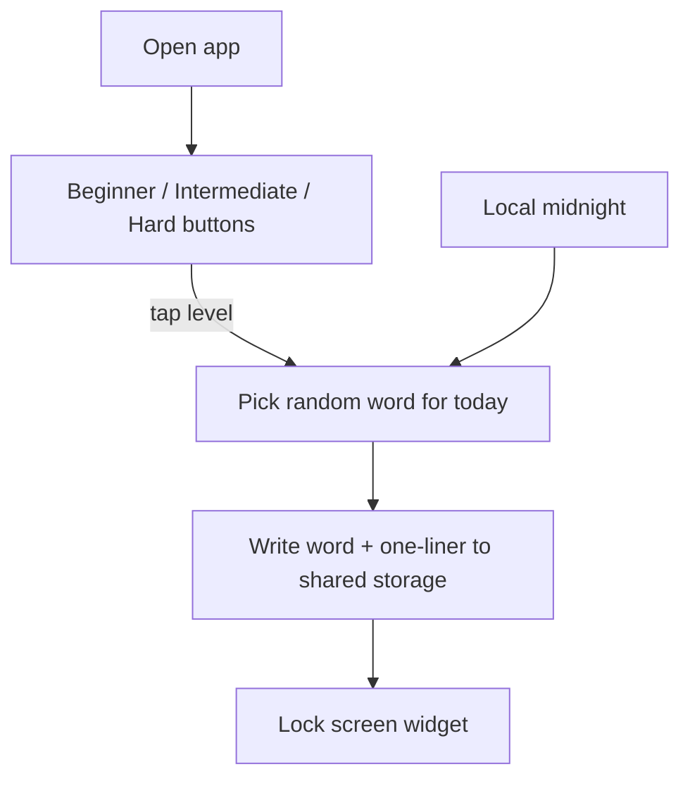
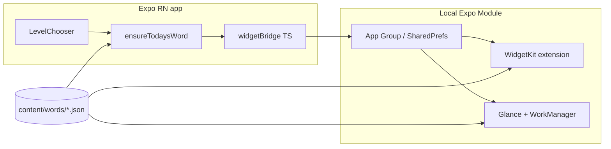

# Daily Vocabulary Lock Screen - Plan

## Goal Capsule

**Objective:** Ship a simple, clean React Native (Expo) app where the learner picks Beginner, Intermediate, or Hard on playful animated buttons, then sees one randomly chosen word from that list each day on the lock screen with a one-line explanation, rotating at local midnight.

**Product authority:** Product Contract in this document (from `ce-brainstorm`). Planning Contract and Implementation Units below define how to build it.

**Open blockers:** None.

**Stop when:** Level chooser works on iOS and Android; widgets show today’s word + one-liner; midnight rollover works with the app closed; catalog validation runs in CI; AE1–AE4 pass on device or simulator.

**Execution profile:** Greenfield under `vedanth.vasudev/code/daily-vocab/`. Leave `Utilita/` untouched. Prefer test-first for domain selection logic; smoke/manual for widgets.

**Product Contract preservation:** Product Contract unchanged in behavior. Deferred planning questions resolved as KTDs below (Expo workflow, same-screen today word, animation approach, one-liner budget).

## Product Contract

### Summary

A minimal vocabulary habit app. Open the app → tap one of three fun level buttons → done. From then on, the lock screen shows one random word from that level’s list with a one-liner, changing at local midnight. React Native owns the simple app UI; native WidgetKit / Glance shells own the lock-screen surface.

### Problem Frame

People want bigger vocabularies without studying. A calm daily word on the lock screen beats opening another dense learning app. The in-app experience should stay almost trivial: pick a difficulty, then let the lock screen do the teaching.

### Approaches considered

**A. React Native companion app + thin native widgets (chosen)**
TypeScript/React Native for the level picker and preference bridge. Native widgets render today’s word + one-liner from shared storage / bundled catalog.

**B. Kotlin Multiplatform**
Rejected; product owner wants React Native.

**C. Fully native twins**
Rejected for v1 cost; product is intentionally simple.

### Key Decisions

- **KD1. Stack: React Native + native widget shells.** Companion app in React Native (TypeScript). Lock-screen widgets in Swift WidgetKit and Kotlin Glance.
- **KD2. UI is intentionally tiny.** v1 app screens are: level chooser (primary), today’s word + one-liner on the same screen after selection, and a short add-widget tip. No courses, quizzes, streaks, or dense dictionaries.
- **KD3. Levels are Beginner, Intermediate, Hard.** Three equal fun buttons with entrance / press animations. Labels use “Hard” (not “Advanced”).
- **KD4. Random word per local day.** After a level is chosen, each local calendar day picks one word at random from that level’s 1000-word list. The pick is stored so it stays stable all day across app and widgets, then a new random word is chosen after local midnight.
- **KD5. Lock screen copy is word + one-liner only.** The catalog’s explanation field is a single short line suitable for the widget. No long essay definitions in v1.
- **KD6. Offline static catalog.** 1000 words per level, shipped in the app as JSON. No backend in v1.
- **KD7. Level choice is sticky.** Opening the app again shows the chooser with the current level highlighted so the learner can switch; switching immediately rerolls today’s word for the new level and reloads widgets.
- **KD8. Monorepo app project, not Utilita.** `vedanth.vasudev/code/daily-vocab/`. Leave Utilita untouched.
- **KD9. Shared snapshot for widgets.** App or native midnight path writes `{ word, oneLiner, level, localDate, wordId }` into App Group / SharedPreferences; widgets render that payload.

### Actors

- A1. Learner — opens app, taps a level, adds the widget, glances at the lock screen daily.
- A2. Content maintainer — edits the three word lists and one-liners.
- A3. OS widget host — iOS WidgetKit / Android keyguard or home widget host.

### Key Flows

- F1. Choose level
  - **Trigger:** Learner opens the app.
  - **Steps:** See three animated buttons (Beginner / Intermediate / Hard) → tap one → preference saved → today’s random word picked and written to shared storage → widgets reload → short tip to add the lock-screen widget if needed.
  - **Outcome:** Level is set; lock screen can show today’s word + one-liner.
- F2. Daily random rollover
  - **Trigger:** Local midnight.
  - **Steps:** Native schedule / timeline picks a new random word from the active level list (avoiding immediate repeat of yesterday when possible) → updates shared snapshot → widget shows the new pair.
  - **Outcome:** One new random word for the day without opening the app.
- F3. Switch level
  - **Trigger:** Learner taps a different level button.
  - **Steps:** Save new level → pick a new random word for today from that list → update widgets.
  - **Outcome:** Lock screen reflects the new difficulty immediately.
- F4. Tap widget
  - **Trigger:** Learner taps the lock-screen widget.
  - **Steps:** Open the app on the level chooser (current level highlighted) with today’s word + one-liner visible.
  - **Outcome:** Same content as the widget, with an easy way to change level.

### Requirements

**App experience**

- R1. The first meaningful screen is a clean level chooser with three buttons: Beginner, Intermediate, Hard.
- R2. The three buttons use light, playful animations (entrance and press feedback). Motion supports clarity; it does not clutter the screen.
- R3. The app stays simple: no accounts, no feed, no multi-tab study UI in v1.
- R4. After a level is selected, the same screen shows today’s word + one-liner and a brief “add to lock screen” tip.

**Content**

- R5. Three static lists ship with the app: Beginner, Intermediate, Hard — 1000 words each.
- R6. Each entry has a stable id, level, headword, and one-line explanation sized for a lock-screen widget.
- R7. Content works fully offline after install.

**Daily random word**

- R8. With a level selected, exactly one word from that level’s list is active per local calendar day.
- R9. That word is chosen randomly from the level list, then held stable until local midnight.
- R10. At local midnight a new random word is chosen for the active level.
- R11. App and widgets always show the same stored pick for the current local date.
- R12. Native widgets can roll to the next day’s random word without the React Native JS runtime running.

**Lock screen**

- R13. The widget shows the headword and its one-liner only.
- R14. iOS supports an appropriate Lock Screen widget family; Android supports lock-screen where available and home-screen as fallback.
- R15. Refresh uses midnight-oriented schedules / timelines, not minute polling.

**Maintainability**

- R16. TypeScript owns in-app selection helpers and is unit-tested.
- R17. Native midnight random selection follows the same persistence rules and is covered by parity checks against shared fixtures where practical.
- R18. CI validates catalog shape, counts, unique ids, and one-liner length budget.

### Acceptance Examples

- AE1. First open
  - **Covered by:** R1, R2, R4
  - **Given:** Fresh install
  - **When:** Learner opens the app
  - **Then:** They see only the three animated level buttons as the main action (plus minimal branding), not a dashboard
- AE2. Random but stable for the day
  - **Covered by:** R8, R9, R11
  - **Given:** Hard is selected and today’s word is already stored
  - **When:** The widget refreshes or the app is reopened the same local day
  - **Then:** The same word + one-liner appear; a different random word is not chosen until local midnight or a level change
- AE3. Midnight change
  - **Covered by:** R10, R12
  - **Given:** Beginner selected, app not opened overnight
  - **When:** Local date rolls past midnight
  - **Then:** Widget shows a new Beginner word + one-liner
- AE4. Level switch
  - **Covered by:** R4, R11
  - **Given:** Beginner word showing today
  - **When:** Learner taps Intermediate
  - **Then:** A random Intermediate word replaces today’s snapshot on app and widget immediately

### Success Criteria

- S1. A new learner can choose a level and understand the product in under a minute.
- S2. Lock screen always shows one word + one-liner for the selected level.
- S3. The daily word changes at local midnight and stays put during the day.
- S4. The app looks simple and clean; animations live on the three buttons, not in chrome-heavy layouts.

### Scope Boundaries

**In v1**

- React Native level chooser with Beginner / Intermediate / Hard
- Fun button animations
- Random daily word + one-liner on lock screen
- Static 3000-word English catalog
- Widget setup tip

**Deferred for later**

- Longer definitions, examples, quizzes, streaks, accounts
- “Seen words” history / no-repeat until exhausted
- Multi-language catalogs
- Push notifications
- Monetization
- Migrating widgets onto `expo-widgets` if/when Android + lock-screen support is production-stable

**Outside this product's identity**

- Full dictionary browser
- Lesson courses and grading
- Social / competitive features

### Dependencies / Assumptions

- D1. Lock-screen widgets require native code even with React Native — accepted.
- D2. Android lock-screen widgets vary by launcher; home-screen widget is the fallback.
- D3. “Random” means a new pick per local day, persisted — not re-shuffled on every glance.
- D4. Prefer avoiding yesterday’s word when drawing today’s random pick; full shuffle-bag anti-repeat can wait.
- A1. Catalog language is English for v1.
- A2. Working name “Daily Vocab” until a brand is chosen.
- A3. Hard maps to the third 1000-word list.

### Sources / Research

- Apple WidgetKit midnight timeline entries; Android Glance scheduled updates.
- React Native / Expo apps commonly sync widgets via App Group UserDefaults + SharedPreferences through a local native module.
- Official `expo-widgets` (alpha) can express iOS Lock Screen families, but Android support is still landing and midnight custom selection still needs native schedule glue — v1 uses local Expo Modules for reliability (see KTD1).

## Planning Contract

### Assumptions

- Expo SDK current-stable with TypeScript and Continuous Native Generation (`expo prebuild`), not Expo Go for final widget builds (custom native modules require a dev client / EAS build).
- One-liner max length: **80 characters** (CI-enforced). Truncate visually on smaller widget families if needed.
- Post-select UI stays on the **same screen** under the three buttons (today’s word + widget tip), not a separate route.
- Button motion: staggered fade/slide entrance + spring scale on press via `react-native-reanimated`.
- Initial catalog may ship as schema + validator + seeded samples first; full 1000×3 content is its own unit before release.
- App Group id / Android preference name use a stable reverse-DNS prefix, e.g. `group.com.dailyvocab.app` (final bundle id chosen at scaffold).

### Key Technical Decisions

- **KTD1. Expo + local Expo Modules for widgets (not alpha `expo-widgets` as the v1 path).** Use Expo for the RN app and local modules (`modules/widget-bridge`) with Swift WidgetKit + Kotlin Glance. Official `expo-widgets` is promising for iOS but alpha; Android is incomplete. Midnight random selection needs native code anyway.
- **KTD2. Shared snapshot contract is the sync boundary.** Keys: `level`, `localDate` (`YYYY-MM-DD`), `wordId`, `word`, `oneLiner`. JS writes on select/switch; native midnight path rewrites when the date changes. Widgets never invent their own word while a valid same-day snapshot exists.
- **KTD3. Domain logic is pure TypeScript with an injectable RNG and clock.** `ensureTodaysWord({ level, catalog, state, now, random })` returns updated state. Native ports mirror the algorithm; shared JSON fixtures assert parity.
- **KTD4. Catalog format is one JSON file per level.** Shape: `{ "version": 1, "level": "beginner"|"intermediate"|"hard", "words": [{ "id": string, "word": string, "oneLiner": string }] }` with exactly 1000 entries at release.
- **KTD5. Content lives under `vedanth.vasudev/code/daily-vocab/content/words/` and is bundled into both JS and native targets** (copied into iOS/Android assets during prebuild or via config plugin).
- **KTD6. Randomness uses a day-stable seed fallback only if needed; preferred path is store-the-pick.** Do not recompute a seeded index that could drift if catalog order changes mid-day; store `wordId` for the date.
- **KTD7. iOS targets Lock Screen `accessoryRectangular` (and `accessoryCircular` if word-only fits); Android ships a home-screen Glance widget and enables keyguard category where supported.**
- **KTD8. Leave `Utilita/` alone.** All new code under `vedanth.vasudev/code/daily-vocab/`.

### High-Level Technical Design

**Selection algorithm (authoritative)**

1. Load active `level` and prior `DailyState`.
2. If `state.localDate === today` and `state.level === level`, return `state` unchanged.
3. Else pick a random `wordId` from that level’s list, skipping `state.wordId` when possible.
4. Persist new `DailyState` and call `reloadWidgets()`.

### Sequencing

1. Scaffold + domain + content schema (can develop UI without widgets).
2. Level chooser UI.
3. Widget bridge + iOS widget + Android widget (bridge first).
4. Wire end-to-end + full catalog + CI.
5. Device QA for midnight and AE scenarios.

### Risks & Dependencies

- **Rsk1. Widget midnight timing is best-effort on both OSes.** Mitigate with precomputed next-midnight timeline (iOS) and a scheduled worker (Android); accept small delay past 00:00.
- **Rsk2. Android lock-screen placement is OEM-dependent.** Mitigate with home-screen widget + in-app tip copy that mentions both.
- **Rsk3. Native/JS selection drift.** Mitigate with shared fixtures and parity tests.
- **Rsk4. Authoring 3000 one-liners is the largest content effort.** Mitigate by sequencing schema/samples first; block store release on full counts via CI.
- **Dep1.** Xcode + Apple developer account for iOS widget testing; Android Studio / device for Glance.
- **Dep2.** EAS Build or local prebuild for any widget-bearing binary.

## Implementation Units

### U1. Scaffold Expo app

**Goal:** Create the Expo TypeScript app shell under `vedanth.vasudev/code/daily-vocab/` that builds for iOS and Android.

**Requirements:** R3, KD8, KTD1, KTD8

**Files:**
- Create: `vedanth.vasudev/code/daily-vocab/package.json`
- Create: `vedanth.vasudev/code/daily-vocab/app.json` (or `app.config.ts`)
- Create: `vedanth.vasudev/code/daily-vocab/App.tsx` (or `src/App.tsx`)
- Create: `vedanth.vasudev/code/daily-vocab/tsconfig.json`
- Create: `vedanth.vasudev/code/daily-vocab/README.md` (run/build notes)
- Create: `vedanth.vasudev/code/daily-vocab/.gitignore`

**Approach:** Initialize Expo (TypeScript template) in `vedanth.vasudev/code/daily-vocab`. Pin Reanimated for later UI. Document `npx expo prebuild` + dev client requirement for widgets. Do not modify Utilita.

**Test scenarios:**
1. `npm install` and TypeScript check succeed in `vedanth.vasudev/code/daily-vocab`.
2. App launches to a placeholder screen on iOS simulator and Android emulator (smoke).

**Verification:** App boots; README lists prebuild/dev-client steps.

**Dependencies:** None

---

### U2. Catalog schema, samples, and CI validator

**Goal:** Define the word JSON contract, seed small sample lists, and fail CI on invalid catalogs.

**Requirements:** R5, R6, R7, R18, KTD4, KTD5

**Files:**
- Create: `vedanth.vasudev/code/daily-vocab/content/words/beginner.json`
- Create: `vedanth.vasudev/code/daily-vocab/content/words/intermediate.json`
- Create: `vedanth.vasudev/code/daily-vocab/content/words/hard.json`
- Create: `vedanth.vasudev/code/daily-vocab/content/words/schema.json` (or Zod schema in TS)
- Create: `vedanth.vasudev/code/daily-vocab/content/tools/validate-catalog.ts`
- Create: `vedanth.vasudev/code/daily-vocab/content/tools/validate-catalog.test.ts`
- Modify: `vedanth.vasudev/code/daily-vocab/package.json` (script `content:validate`)
- Optional: root or app CI workflow step calling `content:validate`

**Approach:** Enforce `version`, `level`, unique `id`s, non-empty `word`, `oneLiner` length ≤ 80. Samples may be ~20 entries each until U8 fills to 1000. Validator accepts a `--strict-count` flag required before release.

**Test scenarios:**
1. Valid sample files pass validation.
2. Duplicate id fails.
3. `oneLiner` over 80 chars fails.
4. Wrong `level` field fails.
5. `--strict-count` fails when length ≠ 1000.

**Verification:** `npm run content:validate` green on samples; intentional breakage fails.

**Dependencies:** U1

---

### U3. Daily word domain logic (test-first)

**Goal:** Pure TypeScript selection that keeps a random word stable for the local day and rerolls on new day or level change.

**Requirements:** R8–R11, R16, KD4, KTD3, KTD6, AE2, AE4

**Files:**
- Create: `vedanth.vasudev/code/daily-vocab/src/domain/types.ts`
- Create: `vedanth.vasudev/code/daily-vocab/src/domain/catalog.ts`
- Create: `vedanth.vasudev/code/daily-vocab/src/domain/ensureTodaysWord.ts`
- Create: `vedanth.vasudev/code/daily-vocab/src/domain/ensureTodaysWord.test.ts`
- Create: `vedanth.vasudev/code/daily-vocab/src/domain/localDate.ts`
- Create: `vedanth.vasudev/code/daily-vocab/src/domain/localDate.test.ts`

**Approach:** Export `ensureTodaysWord(input) -> DailyState`. Inject `now` and `randomInt`. Skip previous `wordId` when list size > 1. Load catalog JSON in JS via bundler import or require.

**Test scenarios:**
1. Same day + same level returns identical `wordId` without calling random again.
2. New local date picks a new word (random stubbed).
3. Level change same day picks from the new list.
4. When previous id exists, next pick is not that id (stubbed random sequence).
5. `localDate` formatting uses device-local calendar date, not UTC day boundary (fixed timezone fixtures).

**Verification:** Domain unit tests pass.

**Dependencies:** U2

---

### U4. Level chooser UI with animations

**Goal:** Simple clean home screen: three animated buttons, selected level highlight, today’s word + one-liner, widget tip.

**Requirements:** R1–R4, R2, KD2, KD3, KD7, AE1, S1, S4

**Files:**
- Create: `vedanth.vasudev/code/daily-vocab/src/screens/HomeScreen.tsx`
- Create: `vedanth.vasudev/code/daily-vocab/src/components/LevelButton.tsx`
- Create: `vedanth.vasudev/code/daily-vocab/src/theme/colors.ts`
- Create: `vedanth.vasudev/code/daily-vocab/src/storage/appPreferences.ts` (level + DailyState via AsyncStorage or MMKV for app-side)
- Modify: `vedanth.vasudev/code/daily-vocab/src/App.tsx` (or `App.tsx`)

**Approach:** One composition: brand/title modest, three large buttons, then today’s word block after selection. Staggered entrance + spring press with Reanimated. Persist level and daily state app-side; widget bridge wired in U7. Keep visual noise low — no cards grid, no stats.

**Test scenarios:**
1. Component/unit or detox-lite smoke: rendering three labels Beginner / Intermediate / Hard.
2. Selecting a level shows word + one-liner region (can stub domain).
3. Reopening restores highlighted level (preference persistence test).

**Verification:** Manual UI review on simulator — clean first viewport, AE1 satisfied.

**Dependencies:** U1, U3

---

### U5. Widget bridge Expo Module (shared storage + reload)

**Goal:** Native module API to write/read the snapshot and request widget reloads on both platforms.

**Requirements:** R11, R12, KD9, KTD2

**Files:**
- Create: `vedanth.vasudev/code/daily-vocab/modules/widget-bridge/src/index.ts`
- Create: `vedanth.vasudev/code/daily-vocab/modules/widget-bridge/ios/...` (App Group UserDefaults)
- Create: `vedanth.vasudev/code/daily-vocab/modules/widget-bridge/android/...` (SharedPreferences / DataStore)
- Create: `vedanth.vasudev/code/daily-vocab/modules/widget-bridge/expo-module.config.json`
- Modify: `vedanth.vasudev/code/daily-vocab/app.config.ts` (App Group / package config plugin bits)
- Create: `vedanth.vasudev/code/daily-vocab/src/native/widgetBridge.ts` (typed wrapper)

**Approach:** Methods: `setDailySnapshot(snapshot)`, `getDailySnapshot()`, `reloadWidgets()`. Document App Group capability on iOS. Keep payload JSON-serializable and small.

**Test scenarios:**
1. Round-trip write/read snapshot on Android instrumentation or module test harness where available.
2. JS integration smoke: after `setDailySnapshot`, `getDailySnapshot` returns same fields.
3. Calling `reloadWidgets` does not throw when no widget is installed.

**Verification:** Bridge callable from RN; values visible from native debugger / log.

**Dependencies:** U1

---

### U6. iOS WidgetKit extension

**Goal:** Lock Screen widget showing word + one-liner, with midnight timeline advancement using bundled catalog when the date changes.

**Requirements:** R12–R15, F2, AE3, KTD7

**Files:**
- Create: iOS widget extension sources under `vedanth.vasudev/code/daily-vocab/modules/widget-bridge/ios/` or `vedanth.vasudev/code/daily-vocab/targets/DailyVocabWidget/` (config-plugin generated)
- Create: Swift helpers mirroring `ensureTodaysWord` persistence rules
- Create: shared fixture JSON used by parity checks if practical
- Modify: Xcode App Group entitlements via Expo config plugin

**Approach:** Read snapshot; if `localDate` is yesterday/missing relative to today, pick new random word from bundled level JSON, write snapshot, render. Timeline policy `.after(nextMidnight)`. Support `accessoryRectangular`; optional circular with word only. Deep link / tap opens app.

**Test scenarios:**
1. Manual: place Lock Screen widget; matches app word after level select.
2. Manual / developer mode: advance date or inject stale `localDate` → widget shows a new word.
3. Parity fixture: given same catalog slice + RNG seed sequence, Swift helper matches TS expected `wordId` (if harness feasible; otherwise document manual parity checklist).

**Verification:** AE2 and AE3 validated on iOS simulator/device.

**Dependencies:** U2, U3, U5

---

### U7. Android Glance widget + midnight worker

**Goal:** Home/lock-capable widget showing word + one-liner; WorkManager (or exact alarm where appropriate) advances the snapshot after local midnight.

**Requirements:** R12–R15, F2, AE3, KTD7, D2

**Files:**
- Create: Kotlin Glance widget under `vedanth.vasudev/code/daily-vocab/modules/widget-bridge/android/`
- Create: `MidnightWordWorker` (or equivalent)
- Create: catalog asset packaging for Android
- Modify: AndroidManifest via Expo module / config plugin

**Approach:** Same snapshot contract as iOS. On provide/update, if date stale, reroll with Kotlin port of selection rules. Schedule next run near local midnight; also update on boot if useful. Prefer home-screen reliability; set keyguard category when possible.

**Test scenarios:**
1. Manual: widget shows same word as app after select.
2. Manual: force date change / run worker → new word for level.
3. Offline: no network required for update.

**Verification:** AE2 and AE3 validated on Android emulator/device.

**Dependencies:** U2, U3, U5

---

### U8. Wire app to widgets + full catalog release gate

**Goal:** End-to-end path from button tap to widget, full 1000×3 catalog, and CI strict counts.

**Requirements:** R4–R7, R11, R16–R18, F1–F4, S1–S3

**Files:**
- Modify: `vedanth.vasudev/code/daily-vocab/src/screens/HomeScreen.tsx` (call bridge after `ensureTodaysWord`)
- Modify: `vedanth.vasudev/code/daily-vocab/content/words/*.json` (fill to 1000 each)
- Modify: CI to run `content:validate --strict-count`
- Create: `vedanth.vasudev/code/daily-vocab/docs/widget-setup.md` (short learner-facing tip copy source)
- Create: `vedanth.vasudev/code/daily-vocab/src/domain/parity.fixtures.json` (+ native consumption notes)

**Approach:** On level press: compute state → persist app-side → `setDailySnapshot` → `reloadWidgets`. Populate real English one-liners (licensed/original). Keep tip copy platform-aware (iOS Lock Screen vs Android widget shelf).

**Test scenarios:**
1. AE1–AE4 manual checklist signed off on both platforms.
2. Strict catalog validation passes (1000×3).
3. Domain unit tests still green against full catalogs (performance sanity: load once).

**Verification:** Full AE checklist; CI green with `--strict-count`.

**Dependencies:** U4, U5, U6, U7, U2, U3

## Verification Contract

| Gate | Command / action |
| --- | --- |
| Domain tests | `cd vedanth.vasudev/code/daily-vocab && npm test` (Jest/Vitest for `src/domain/**`) |
| Catalog (dev) | `npm run content:validate` |
| Catalog (release) | `npm run content:validate -- --strict-count` |
| Typecheck | `npx tsc --noEmit` |
| iOS smoke | Dev-client build; place Lock Screen widget; AE1–AE4 |
| Android smoke | Dev-client build; place home widget; AE1–AE4 |
| Midnight | Stale `localDate` injection or system date change; confirm reroll with app killed |

No `release:validate` skill in this repo today — treat device AE checklist + CI scripts as the release gate.

## Definition of Done

- All Implementation Units U1–U8 complete.
- Product requirements R1–R18 satisfied or explicitly waived in writing.
- AE1–AE4 pass on iOS and Android.
- Strict catalog validation passes (1000 words × 3 levels, one-liners ≤ 80 chars).
- Abandoned scaffold/experiment code removed from the diff.
- `Utilita/` unchanged.
- README documents how to prebuild, run, and place widgets.

## Appendix

### Suggested first milestone slice

Ship U1–U5 + U4 UI with Android or iOS widget (one platform) before the second platform, then finish U8 content. Prefer proving the bridge early over finishing all 3000 words first.

### Working name

“Daily Vocab” until brand is chosen (A2).
---
